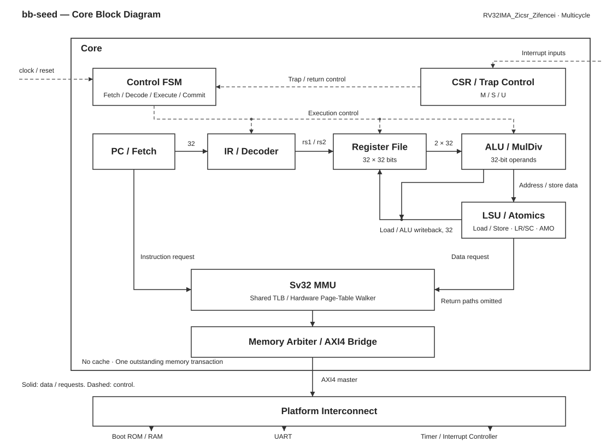

# bb-seed

A single-core RV32 processor developed with AI in Chisel. Start with a multicycle core that boots Linux into a BusyBox shell, then optimize PPA in the Buckyball framework.

## MVP Specification

| Item | Design |
| --- | --- |
| ISA | `RV32IMA_Zicsr_Zifencei` |
| Execution | Single core, single issue, multicycle, no speculative execution |
| Multiply/divide | Multicycle implementation |
| Privilege modes | M / S / U |
| Address translation | Sv32, hardware page-table walker, small shared TLB |
| Caches | None initially; instruction fetches and data accesses execute serially |
| Internal memory interface | Simple request/response interface, converted to AXI4 by a bridge |
| External interfaces | One AXI4 master, clock, reset, and timer/software/external interrupt inputs |
| AXI4 transactions | Single-beat accesses, with at most one outstanding transaction |
| Software | OpenSBI + Linux + soft-float `ilp32` BusyBox initramfs |

The MVP excludes the C, F/D, and V extensions, multicore support, DMA, and cache coherence. The CPU is the only master accessing RAM. AMO and LR/SC implementation and verification rely on this platform constraint; adding other masters will require revisiting atomicity guarantees.

## AI and RSI

bb-seed explores RSI through iterative hardware design: AI modifies Chisel, runs verification and PPA evaluation, and uses the results to guide the next iteration. Engineers define the goals and review the changes.

The project is currently at the planning stage; RTL and the automated feedback loop are not yet implemented.

## Architecture Overview

The block diagram shows the target MVP architecture, not pipeline stages. Solid lines denote data or memory-request paths; dashed lines denote control signals. Return paths and local control connections are simplified. Modules will be added incrementally during development.



Instruction fetches, data accesses, and page-table walks share the external AXI4 master. UART, timers, the interrupt controller, and RAM belong to the platform. Interrupts reach the core through dedicated signals; ordinary AXI4 memory transactions do not replace interrupt inputs.

The boot sequence is:

```text
Reset -> Boot ROM -> OpenSBI (M-mode) -> Linux (S-mode) -> BusyBox (U-mode)
```

Initially, the simulation environment preloads OpenSBI, Linux, the device tree, and initramfs. U-Boot, block devices, and booting from persistent storage are outside the initial scope.

## Implementation Plan

| Stage | Work | Acceptance Criteria |
| --- | --- | --- |
| 1. Bare-metal RV32I | Register file, ALU, decoder, multicycle FSM, simulated memory | Run arithmetic, branch, and load/store programs |
| 2. M extension and M-mode | Multiply/divide, CSRs, exceptions, `ECALL`, `MRET`, timer interrupts | Run a bare-metal timer example |
| 3. Atomics and bus integration | LR/SC, AMO, `FENCE`, `FENCE.I`, AXI4 bridge, UART | Pass atomic-operation tests and produce UART output |
| 4. Privilege and virtual memory | S/U modes, trap delegation, `SRET`, Sv32, page permissions, A/D bit handling, `SFENCE.VMA` | Verify translation, user-mode execution, and page faults |
| 5. Linux boot | Platform devices, OpenSBI, Linux configuration, device tree, initramfs | Reach a shell and run `echo` and `cat /proc/cpuinfo` |
| 6. PPA optimization | Pipelining, caches, critical-path and area optimization | Evaluate and iterate using actual process libraries |

Begin with `Core.scala`, `Decoder.scala`, `RegFile.scala`, and `Alu.scala`, running a small program with `addi -> add -> sw -> lw -> branch loop`. Introduce `CsrFile`, `MulDiv`, `Mmu`, and `AxiBridge` as later stages require them.

## Verification and PPA

Starting with RV32I, record each retired instruction's PC, encoding, and register writeback for differential testing against a reference model. Add targeted tests for exceptions, the MMU, atomic operations, and AXI4 handshakes. Reaching the Linux shell is the system-level acceptance milestone.

The following targets will be evaluated in the Buckyball framework. Their feasibility has not yet been established.

| Process | Area Target | Frequency Target |
| --- | --- | --- |
| 28nm | ≤ 0.05 mm² | ≥ 1 GHz |
| 180nm | ≤ 2 mm² | ≥ 500 MHz |

PPA reports will distinguish core logic area, core area including cache SRAM, and subsystem area including bus and interrupt/timer wrappers. Whether the final area budget includes SRAM remains to be decided. Frequency must be based on post-layout timing at specified process, voltage, and temperature (PVT) conditions. Power results must state the workload and switching activity assumptions. The 500 MHz target at 180nm requires an early feasibility check with the actual process library.

The cacheless, multicycle MVP establishes a functional baseline; it is not the final performance implementation.

## References

- [Linux 6.12 RISC-V Build Configuration](https://github.com/torvalds/linux/blob/v6.12/arch/riscv/Makefile)
- [RISC-V Linux Boot Requirements](https://docs.kernel.org/arch/riscv/boot.html)
