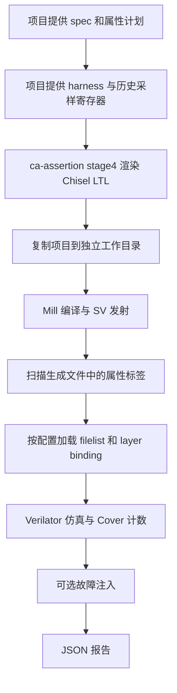

# chisel-iabv 产品审查与改进建议

审查日期：2026 年 10 月 8 日。面向 Seed 和 chisel-iabv 的开发维护者。

当前工具已经具备可运行的属性计划渲染、隔离构建和断言仿真流程，适合作为产品原型继续开发。但在把它用于更多模块之前，需要先修复 **PASS 判定的可信度问题**：本次审查复现了漏绑 Assert 层后，错误属性仍被整条流程判为通过的情况。

建议下一阶段按以下顺序推进：**断言实际执行的证据 → 配置和需求追踪 → 稳定发布与回归 → 自动属性规划 → 形式化后端**。当前最紧迫的工作是提高结果可信度。

## 1 审查范围与版本

本次检查覆盖 `src/product/` 的 CLI、契约检查、生成桥接、Mill 和 Verilator 适配器、工作流、15 项回归测试，以及它们实际调用的 ca-assertion 渲染函数和 Seed PCReg 用例。没有将整个研究、训练和历史实验目录视为已经完成审查。

| 项目 | 审查时状态 |
| --- | --- |
| Seed HEAD | `1f8cad89820db68c99a50371a523e344b30c52d2` |
| chisel-iabv HEAD | `060e9e57866034b3d6a93c7e37093bb69c7b5714` |
| 工作区 | 两个仓库都有未提交改动；实际检查对象包含这些改动 |
| 后端 | Verilator 5.046，断言仿真 |
| 自动属性规划 | 未接入产品入口；当前计划由项目提供 |
| 形式化证明 | 未执行，报告为 `formal_status: not_run` |

[审查版本与源码指纹](chisel-iabv-review-20261008/evidence.json)记录实际检查的 product Python 文件哈希，避免把工作区能力误认为上述 HEAD 已发布的能力。

审查只新增分析文档、证据和隔离复现用例，没有修复或改写产品实现，也没有改变现有 PCReg 行为。运行中的其他 RTL 重命名和编辑不属于本次修改范围。

## 2 现在的产品实际上做了什么



关键区别是：**工具已经能把明确的属性计划变成 Chisel Assertion 代码，但验证意图仍主要由人输入。** `spec` 用于编号关联；`precondition`、`check`、复位策略和历史值采样由 Seed 的计划与 harness 明确给出。

例如 PCReg 的 `previousPc`、`previousTarget` 是项目手写的采样上下文，product 不会自行从 spec 推导它们。[harness 源码](../../verification/pc-reg/src/main/scala/PCRegVerificationTop.scala#L21)

### 已经值得保留的设计

- 生成器原始响应、生成后的 Scala、隔离 workspace 和编译报告分开保存，便于追踪。
- 工作流不在原始 RTL 上插桩；本次反向测试也没有修改真实 Seed 输入。
- 使用真实 Mill 项目和 Chisel 7.16 工具链，已经处理独立的 assertion 和 cover layer 文件。
- 报告明确区分 `llm_invoked: false` 和 `formal_status: not_run`。
- 当前 PCReg 配置确实执行了 5 条 Assert 和 6 条 Cover，`+4 → +8` 的负例被递增断言捕获。

因此，原有 PCReg 测试结果有实际价值。下面发现的漏洞限制的是产品对任意配置作出 PASS 判断的可靠程度，并不意味着原有测试完全没有执行断言。

## 3 问题与优先级总览

P0 表示会影响 PASS 可信度，应阻止对外发布；P1 表示进入稳定产品前必须解决；P2 表示扩展模块或提高可用性时需要处理。标记“缺口”的项目属于尚未实现的能力，不等同于现有函数出错。

| 编号 | 优先级 | 问题 | 证据类型 |
| --- | --- | --- | --- |
| F01 | P0 | 属性存在于文件，却没有绑定执行，流程仍可 PASS | 成对端到端复现 |
| F02 | P1 | 缺少属性非空触发与需求覆盖检查 | 校验器复现与代码检查 |
| F03 | P1 | 生成器的 assertion_map 为空，源码追踪接口不兼容 | 实际生成产物 |
| F04 | P1 | 配置校验不完整，错误发现过晚或变成异常堆栈 | 校验器复现 |
| F05 | P1 | Ctrl+C 后后台构建进程仍可能运行 | 进程控制复现 |
| F06 | P1 | 当前产品代码尚未进入固定 submodule 提交 | Git 状态检查，发布缺口 |
| F07 | P1 | 自动 spec 规划和可审查的计划生成过程缺失 | 产品能力缺口 |
| F08 | P2 | Cover 按标签汇总，掩盖不同实例的覆盖差异 | 覆盖数据解析复现 |
| F09 | P2 | 采样语义依靠字符串和人工计划，缺少独立时序契约 | 接口与用例检查 |
| F10 | P2 | 原工程变化被混入验证失败，报告状态不够精确 | 既有失败报告与实现 |
| F11 | P2 | 工程接入和结果浏览仍偏向脚本使用者 | 接口与构建检查 |
| F12 | P2 | 回归覆盖范围小于产品宣称的通用范围 | 测试与后端范围检查 |

## 4 F01 未执行的断言也可能得到 PASS

### 复现方法和结果

在 Seed 隔离副本中，把 `REQ_PC_003_ADVANCE` 的结果条件改为 `io.pc === 1.U`。这个条件与测试中的顺序递增行为冲突，理应触发失败。为了单独检查 baseline 的可信度，两个用例都关闭可选 mutations。

两个副本的输入只有 `job.json` 中的 layer 列表不同，生成的 Scala 哈希完全一致。

| 用例 | Assert 层绑定 | Cover 层绑定 | 实际结果 |
| --- | --- | --- | --- |
| 对照 | 保留 | 保留 | 仿真在 `REQ_PC_003_ADVANCE` 失败，CLI 返回 1 |
| 漏绑 | 移除 | 保留 | 10,027 周期完成、六项 Cover 命中、最终 PASS，CLI 返回 0 |

证据：[漏绑报告](chisel-iabv-review-20261008/unbound-report.json)、[对照报告](chisel-iabv-review-20261008/bound-report.json)、[对照断言失败日志](chisel-iabv-review-20261008/bound-simulation.log)。

### 原因

`check_emitted_properties()` 扫描整个产物目录中的 `label: assert property` 文本；后端实际执行哪些文件和层，则由 `filelist` 与 `layers` 决定。两者之间没有执行模型一致性检查。[文本扫描](https://github.com/nick-2001/chisel-iabv/blob/ae5f7a0013f5c6e9cabc3eedb9b606c9c57b3c23/src/product/adapters/verilator.py#L32) · [后端文件选择](https://github.com/nick-2001/chisel-iabv/blob/ae5f7a0013f5c6e9cabc3eedb9b606c9c57b3c23/src/product/adapters/verilator.py#L8)

断言模块虽然存在于生成文件中，却没有实例化到测试顶层。独立参考模型会检查正确 DUT，因此仍通过；Cover 层独立绑定，也仍通过。可选 mutation 为空时，没有其他机制发现 Assert 层缺失。[通过条件](https://github.com/nick-2001/chisel-iabv/blob/ae5f7a0013f5c6e9cabc3eedb9b606c9c57b3c23/src/product/workflows/assertion.py#L91)

单元探针还证明，被未启用的预处理条件包住的属性也能通过当前文本扫描。[校验探针结果](chisel-iabv-review-20261008/unit-probes.json)

### 改进与验收

1. 产物收集阶段生成正式的模块、属性、层和绑定清单。
2. 后端检查声明属性是否进入实际 elaboration 模型，并报告实例路径；仅存在于文件中不算“已启用”。
3. 缺少必要 layer 或预处理禁用了属性时，在仿真前返回配置或绑定错误。
4. mutation 是补充证据；单条 mutation 的成功不能替代其他属性的绑定检查。

**验收门槛：漏绑用例必须失败，正确绑定的错误属性必须触发对应断言，正确配置的 PCReg 基线仍通过。**

## 5 F02 需求关联和非空触发检查不足

当前 `requirement_id in spec_text` 是子串查找。不存在的完整编号 `REQ-PC-00` 会因为匹配 `REQ-PC-001` 而被接受。[需求检查](https://github.com/nick-2001/chisel-iabv/blob/ae5f7a0013f5c6e9cabc3eedb9b606c9c57b3c23/src/product/contracts/job.py#L38)

工具也会接受 `precondition: false.B` 和 `check: io.pc === io.pc` 的组合。前者使蕴含式从不触发，后者恒成立；现有校验仅拒绝字面量 `true.B`。[属性检查](https://github.com/nick-2001/chisel-iabv/blob/ae5f7a0013f5c6e9cabc3eedb9b606c9c57b3c23/src/product/contracts/job.py#L15)

即便另有 Cover 命中，也不能保证它对应这条 Assert 的有效前件。当前要求至少一条 Assert，但不检查所有可验证需求是否有属性，不要求每条属性具备对应触发证据。属性文件、Cover 文件和需求文档可能各自看起来完整，整体仍漏检。

建议建立结构化需求登记表：每个需求有精确 ID、验证方式、属性列表，以及“不适用或暂未验证”的原因。为每条时序 Assert 自动记录 antecedent 命中次数和有效检查次数，把 `VACUOUS` 与 `PASS` 分开。无需声称静态检查能判定所有时序性质是否有意义；复杂不可达问题应由仿真触发证据或形式化检查补充。

**验收：拒绝部分编号；没有触发过的属性不能显示成“已有效验证”；缺失需求必须显式出现在报告中。**

## 6 F03 属性源码映射在当前命名下丢失

真实 PCReg 生成器响应中有 5 条 Assert 和 6 条 Cover，但 `assertion_map` 是空数组。[产物统计](chisel-iabv-review-20261008/additional-probes.json)

ca-assertion 的注释解析规则要求特定形式的属性编号和需求编号。Seed 使用的 `REQ_PC_001_RESET`、`COV_RESET` 和 `REQ-PC-001` 不符合该规则。[解析规则](https://github.com/nick-2001/chisel-iabv/blob/ae5f7a0013f5c6e9cabc3eedb9b606c9c57b3c23/src/ca-assertion/utils/schema/protocol_v1.py#L38) · [映射生成](https://github.com/nick-2001/chisel-iabv/blob/ae5f7a0013f5c6e9cabc3eedb9b606c9c57b3c23/src/ca-assertion/utils/schema/protocol_v1.py#L3089)

Product 自己的 `requirement_mapping` 从人工计划复制 ID，因此报告仍看起来有映射，但缺少生成文件行号和实际插入结果的可靠对应。后续若要“点击失败断言跳回需求和 Chisel 行”，现有信息不足。

`provided` 模式也仅检查产物中的同名标签和种类，没有验证 plan 表达式与提供的属性源码一致；这一点是代码检查结论，本次没有另外运行 provided 模式的语义错配实验。

建议统一跨层 property ID，并让生成器直接返回结构化映射，包含需求 ID、模块实例、生成文件、源码区间和语义摘要。不要靠再解析注释恢复本来已知的信息；提供属性模式应区分“标签关联”与“语义已核对”。

**验收：本例返回 11 条可定位映射；任一实际生成缺失项不能被计划中的同名条目掩盖。**

## 7 F04 配置错误没有完整的提前检查

以下输入在本次探针中均被 `validate_job()` 接受：

- 缺少 `layers`、`filelist`、`result_file`、`coverage_file`。
- `run_timeout: null`，后续会作为无限等待传给进程等待逻辑。

`check: []` 则让 `validate_plan()` 抛出 `AttributeError`；CLI 的异常分类没有覆盖它，可能以 traceback 结束。[配置检查](https://github.com/nick-2001/chisel-iabv/blob/ae5f7a0013f5c6e9cabc3eedb9b606c9c57b3c23/src/product/contracts/job.py#L45) · [CLI 异常处理](https://github.com/nick-2001/chisel-iabv/blob/ae5f7a0013f5c6e9cabc3eedb9b606c9c57b3c23/src/product/cli.py#L20)

这会让原本应在启动前发现的问题，延迟到生成、编译甚至运行之后才暴露。mutation 字段也主要在 baseline 完成后才检查。

建议定义版本化的完整 job/plan schema：字段类型、必填项、有限正数超时、路径与快照归属、非空 layer 需求、mutation 目标与参数都提前校验。执行结果采用稳定错误码和字段路径，例如 `CONFIG_MISSING_FIELD: backend.layers`。不要只扩大异常捕获范围，让真正的程序错误也变成模糊的配置错误。

**验收：无效输入不启动 Mill 或 Verilator；错误包含字段位置；所有 CLI 退出方式均可预测。**

## 8 F05 取消运行没有完整回收子进程

`command()` 为子进程创建独立 session，并在超时时杀死进程组；这部分设计有用。但是，它只处理超时和 `OSError`，没有对 `KeyboardInterrupt` 或父进程终止执行相同清理。[进程控制](https://github.com/nick-2001/chisel-iabv/blob/ae5f7a0013f5c6e9cabc3eedb9b606c9c57b3c23/src/product/adapters/mill_project.py#L40)

隔离探针启动一个只写标记文件的短时子进程，再向调用者发送 SIGINT。调用者退出后，子进程仍完成写入。[取消实验结果](chisel-iabv-review-20261008/cancellation.json)

真实 Mill、编译器或仿真器可能因此在用户点击停止后继续占用 CPU、写日志或产生输出。工作流也没有明确的 `cancelled` 状态。

建议在进程执行器中统一处理正常退出、超时、SIGINT、SIGTERM 和异常；先终止进程组，再在有限宽限期后强制结束，等待回收，并记录停止原因。避免把 `resource.setrlimit()` 这样的调用者级设置隐藏在可导入 API 中而不说明副作用。

**验收：取消测试后无存活的子进程、无后续写入，报告状态为 cancelled。**

## 9 F06 当前成果还没有形成可复现的发布版本

Seed 固定的工具 commit 是 `060e9e578…`，其中没有 `src/product/cli.py`；这次 product 工作流文件仍在本地未提交状态。`git cat-file -e HEAD:src/product/cli.py` 无法找到它。

因此，另一台机器按 Seed 当前提交拉取 submodule，拿不到本次演示的完整入口。报告记录 `tool_worktree_dirty` 和源码哈希是正确的，但哈希本身不能替代可获取的源代码版本。

此外，报告只单独记录了 `protocol_v1.py` 的 renderer 哈希，没有完整冻结其传递依赖；Mill、JDK、C++ 编译器、实际依赖解析和关键环境配置也没有统一进入机器可读工具链清单。部分信息能从日志、build.mill 和 SV 文件头恢复，但排查与迁移成本较高。

建议将 product、渲染桥接和测试提交成明确版本，更新 Seed submodule 指针；发布前在干净 checkout 中运行。开发态可以保留 dirty 标记，并额外归档补丁或相关源码。记录实际工具链版本与依赖解析结果，避免只记录声明版本。

**验收：干净克隆后仅按说明即可重跑，使用的所有代码版本均可获得。**这属于当前发布阻塞项，不是“允许本地开发”本身有问题。

## 10 F07 自动生成验证意图仍是产品能力缺口

产品已经连接 `stage4_instrument()`，但并没有连接自然语言需求解析、候选属性规划、语义审查和修订过程。`ca_assertion_reviewed_plan` 名称中的 reviewed 也没有配套审阅者、计划版本或审阅记录；目前只能解释为“项目显式提供的计划”。

对用户来说，最困难的工作仍包括：识别应当验证的行为、选择前件和后件、决定时钟与复位策略、定义历史采样、判断哪些输入是假设。当前 product 主要自动化了这些决定之后的执行过程。

建议把产品阶段显式拆成 `plan → review → generate → verify → report`：

- planner 接收 spec、接口、参数和允许观察的信号；输出需求覆盖表和候选属性。
- 不确定的需求和无法绑定的信号应成为待确认项，不能自动猜测后继续发布。
- 保存原始模型响应、模型配置、版本、人工修改记录和批准状态。
- reviewer 检查恒真、不可达、采样点、复位屏蔽、需求来源，以及是否把待证明结论错误写成假设。
- 只有满足明确条件的计划进入代码生成和验证。

不建议先把模型直接接到当前 PASS 判断上。应先修复 F01 至 F04，再扩大自动化范围。

**验收：除 PCReg 外，至少两个不同结构的模块可从 spec 产出可审查计划；未知项、失败项和人工干预均可追踪。**这不是现有渲染器已经达到的能力。

## 11 F08 覆盖统计丢失实例维度

`coverage_counts()` 只保留属性标签，把不同层级路径的命中数相加。[覆盖解析](https://github.com/nick-2001/chisel-iabv/blob/ae5f7a0013f5c6e9cabc3eedb9b606c9c57b3c23/src/product/adapters/verilator.py#L22)

探针中 `TOP.instance0.COV_SHARED = 0`、`TOP.instance1.COV_SHARED = 5` 被合并为 `COV_SHARED = 5`。单实例 PCReg 不受此问题影响；复用多个相同模块时，一个实例的命中可能掩盖另一个实例从未执行。

建议保留 `(property_id, instance_path)` 两级统计，报告中分别展示属性覆盖和实例覆盖，并由配置声明覆盖对象。

**验收：同标签的两个实例，一个为零时，该实例必须显示 uncovered。**

## 12 F09 采样与复位语义仍依赖隐含约定

当前 plan 直接保存 Scala 表达式字符串。harness 提供 `previousPc`，计划再引用它；生成器没有类型化的“当前值、前一拍值、位宽、符号、截断方式”表示。时钟名和 reset 策略也主要靠用户约定与编译结果检查。

当前 PCReg 的方案本身合理：前件使用边沿前输入，下一边沿检查前一更新，历史寄存器保存 target 与 PC，复位属性不被默认 disable 屏蔽。风险在于更复杂模块很容易把这些条件写错，而编译通过无法发现语义错位。

建议先定义有限的时序 IR：`sample(signal, offset)`、有位宽的运算、时钟域、复位时的性质策略、初始有效性和检查窗口，再映射到 Chisel LTL。每种支持的形式都提供仿真对照与故障用例。异步复位、多时钟、可变延迟和公平性应明确列为支持或不支持，不能默认沿用 PCReg 语义。

**验收：跨拍 target 改变、复位插入、初始未知值和位宽溢出都有独立语义测试。**

## 13 F10 验证结论和源码新鲜度应分开表达

现有流程先复制快照，结束时再检查原工程是否变化。如果原工程在快照生成后被编辑，即使该快照的验证全部通过，也会把总状态改成 failed。[状态覆盖逻辑](https://github.com/nick-2001/chisel-iabv/blob/ae5f7a0013f5c6e9cabc3eedb9b606c9c57b3c23/src/product/workflows/assertion.py#L138)

此前一次 PCReg 运行已经遇到这种情况：生成、仿真和 mutation 通过，但 `IFStage.scala` 在运行期间改名，最终报告为输入变化失败。这个检查足够保守，却把“验证失败”和“结果不再对应当前编辑状态”混为一谈。

建议记录三个独立维度：`snapshot_consistent`、`verification_status`、`matches_current_checkout`。如果复制期间不一致，拒绝快照；如果只是复制完成后用户继续编辑，保留对旧快照有效的结论，并提示需要重跑当前版本。还应保证报告和快照使用同一份 spec、plan 内容，减少读文件与复制之间的时间差。

**验收：编辑原工程不会让已经验证的固定快照失去其结论，但界面明确指出结果是否适用于当前文件。**

## 14 F11 工程接入和使用体验还有明显成本

| 当前表现 | 影响 | 建议 |
| --- | --- | --- |
| job 与 Mill manifest 都手写，加上 harness、C++ driver、layers 路径 | 每接一个模块都需要理解产品内部文件组织 | 增加项目检查和模块初始化向导，自动发现能可靠发现的构建信息 |
| product workflow 固定调用 PATH 中的 Mill，未暴露独立适配器已有的 `--mill` 能力 | 使用项目 wrapper 或不同工具版本时不方便 | 统一 ToolchainConfig，透传可执行文件和每阶段限时 |
| `build_file` 被检查与哈希，但不用于选择实际 Mill 构建文件 | 字段含义容易被理解成可切换入口 | 明确限制为实际入口，或实现真实选择并做测试 |
| 每次复制新工程且重建，固定 `-j 2`、始终打开 trace | 小模块重复开发会付出额外时间和磁盘成本 | 按内容哈希缓存构建、可配置并行度与波形策略，保留可复现冷构建 |
| CLI 长时间无阶段进度，只在末尾输出 JSON 路径 | 用户难以判断停在哪一步 | 输出阶段、耗时和报告位置，日志仍保持可机读 |
| 报告由多份 JSON、日志和绝对路径组成 | 查看失败需要在目录中手工寻找 | 增加可分享的 HTML 或 Markdown 总结及相对路径，关联需求、生成代码和反例 |
| 产品必须从 Git checkout 运行、缺少安装入口和兼容性检查 | 新机器接入成本高，归档代码不能直接满足版本查询 | 提供 package/console entry 和 doctor 命令，定义支持矩阵 |

这些是工程检查结论，不代表已经测量了大型模块的性能瓶颈。当前基线产物约 8.2 MiB，单次量级不大；问题是缺少长期运行和大模块的保留策略。

## 15 F12 测试和后端范围不足以支撑通用产品承诺

审查重新执行了 15 项测试，全部通过。这些测试覆盖路径、若干 schema 条件、生成器文本输出、模拟命令失败和超时等；工作流失败测试通过 mock 停在构建失败处，没有覆盖 F01 的完整模型绑定问题。

实际端到端验证主要集中于 PCReg，且是固定参数、固定随机种子、单时钟和单种 mutation。需要补充 FIFO/握手、流水线寄存器、参数化算术等不同类型模块，检查不同实例、复位、反压和时序深度。

目前 `assert`、`cover` 和 Verilator 是明确支持范围；`assume` 被拒绝，形式化后端不存在。因此不能将“随机仿真 PASS”解释为对所有输入序列成立。这个边界已经写入报告，应继续保留。

建议建立三层门禁：快速 schema/渲染测试、少量真实工具链端到端回归、发布前的多模块和版本兼容验证。形式化接入另行定义假设、初始状态、证明深度、完整证明与有界结果、超时、反例及过约束检查。

**验收：每个支持的属性形式和后端都具备至少一个通过用例、一个真实语义失败用例和一个配置失败用例。**

## 16 分阶段改进计划

| 阶段 | 主要交付 | 退出条件 |
| --- | --- | --- |
| 第一阶段 结果可信 | 修复 F01、F02；完整 schema；实例维度覆盖；取消回收 | 漏绑、未触发、漏覆盖与取消测试能稳定识别，正确 PCReg 回归仍通过 |
| 第二阶段 工程可交付 | 结构化 assertion_map、统一工具链配置、错误码、源码与报告版本、干净 checkout 发布 | 新环境一条文档命令跑通，失败能定位到需求和 Chisel 行 |
| 第三阶段 自动规划 | spec/interface 到候选计划、审阅流程、类型化时序 IR、原始响应与修订记录 | 多模块需求覆盖可审查，模型不确定性不会被静默当成正确性 |
| 第四阶段 形式化与规模化 | 正式后端契约、assume 检查、BMC/证明状态、缓存、CI 和报告界面 | 结果区分仿真、有界检查和证明，性能与复现性有持续数据 |

第一阶段不需要重写已有 ca-assertion 系统。优先把“声明了哪些属性、实际执行了哪些属性、每项证据是什么”贯通，再抽取稳定 renderer API，避免把 4,550 行研究协议模块直接当作长期产品接口。

## 17 复现与证据索引

本次反向实验只在 Seed 的 `build/product-review-20261008/` 中创建副本。精简证据已保存在本节链接目录，报告内的完整运行路径对应本机产物。

- [版本与源文件哈希](chisel-iabv-review-20261008/evidence.json)
- [配置和属性校验探针](chisel-iabv-review-20261008/unit-probes.json)
- [覆盖维度和映射探针](chisel-iabv-review-20261008/additional-probes.json)
- [取消回收探针](chisel-iabv-review-20261008/cancellation.json)
- [未绑定错误属性的 PASS 报告](chisel-iabv-review-20261008/unbound-report.json)
- [绑定后错误属性的失败报告](chisel-iabv-review-20261008/bound-report.json)
- [可重复执行的隔离对照脚本](chisel-iabv-review-20261008/reproduce.py)
- [文档所附脚本的实跑结果](chisel-iabv-review-20261008/reproduction-summary.json)

从 Seed 根目录运行以下命令。输出目录必须尚不存在，脚本会使用当前工作区版本；修复后，漏绑用例的预期结果应从错误的 PASS 变成拒绝或失败。

```bash
python3 docs/reviews/chisel-iabv-review-20261008/reproduce.py \
  --project-root . \
  --output /tmp/chisel-iabv-binding-review
```

**总体判断：当前是一个有真实运行证据的 Assertion 产品原型。产品化优先级应由错误 PASS 的风险决定，而不是由新增命令数量决定。**

归档说明：本文保留审查时的结论和证据。后续工具代码已同步到 chisel-iabv 提交 `ae5f7a0`，Seed 在本次归档中固定该版本；F06 中“工具代码未发布”的状态已得到处理。其余缺陷未在本次归档中修复。证据中的本机路径已使用 `$SEED_ROOT` 替换，结果和源码哈希保持原样。
